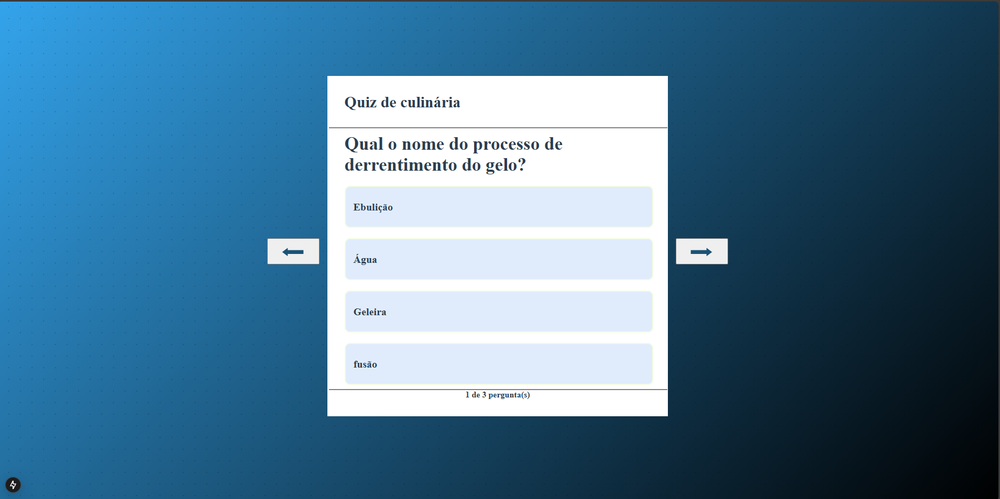
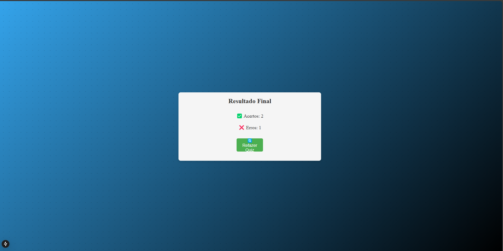

# Quiz Interativo em React

Este projeto é um quiz interativo onde os usuários podem responder perguntas e visualizar seus resultados ao final. Desenvolvido com React, o quiz é dinâmico e permite navegar entre as perguntas, marcar respostas e ver o desempenho no final.

## Funcionalidades

- Navegação entre as perguntas.
- Exibição das alternativas e feedback ao selecionar uma resposta.
- Exibição dos resultados finais: acertos e erros.
- Opção de reiniciar o quiz e tentar novamente.

## Tecnologias

- **React**: Biblioteca JavaScript para construir a interface.
- **CSS**: Estilização personalizada para o quiz.

## Screenshot

## Screenshot resultado final

